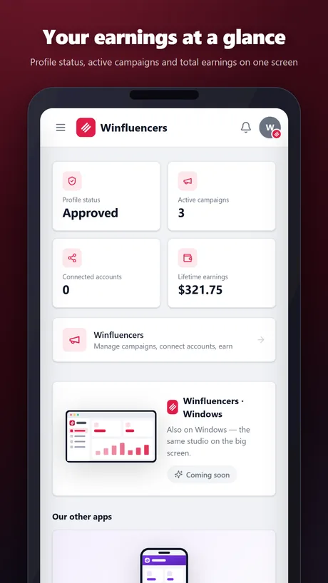
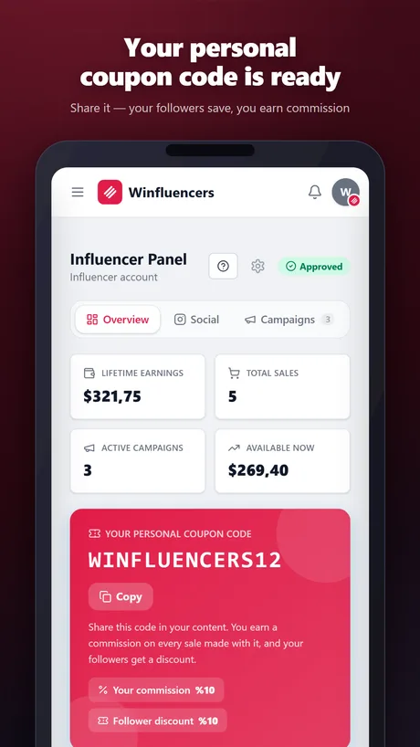
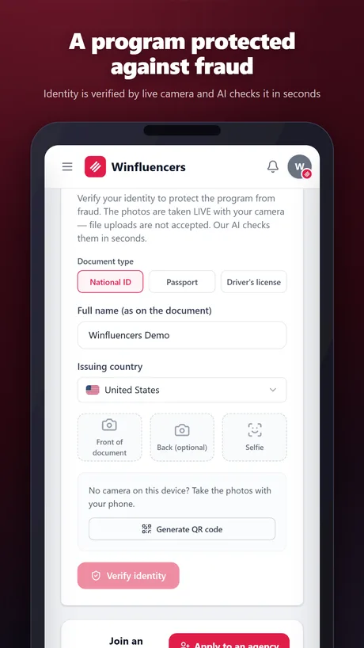
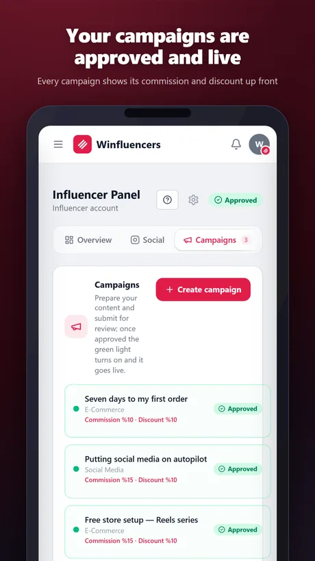

<div align="center">
  
</div>

# Winfluencers Desktop

The native desktop shell for [Winfluencers](https://www.winvestour.com/winfluencers) — Winvestour's influencer program app. Built with [Tauri v2](https://tauri.app): a small, native window (~2 MB) that opens the live Winfluencers web app.

**Download the latest release:** see the [Releases](https://github.com/Winvestour/winfluencers/releases) page for Windows and Linux builds.

<div align="center">

<a href="https://github.com/Winvestour/winfluencers/releases/latest"></a>
<a href="https://github.com/Winvestour/winfluencers/releases"></a>

<a href="LICENSE"></a>

<a href="https://github.com/Winvestour/winfluencers/releases/latest"></a>&nbsp;
<a href="https://github.com/Winvestour/winfluencers/releases/latest"></a>&nbsp;
<a href="https://play.google.com/store/apps/details?id=com.winvestour.influencer"></a>

<a href="https://www.winvestour.com/winfluencers"><b>Website</b></a> · <a href="https://www.winvestour.com/register"><b>Create a free account</b></a> · <a href="https://github.com/Winvestour"><b>All Winvestour apps</b></a>


<sub>Earn commission on sales made with your own coupon code and match with brands.</sub>

</div>


## What this is

This shell contains **no application logic** — it's a thin native window around `https://www.winvestour.com`. All of Winfluencers' actual functionality (applying to campaigns, connecting social accounts, earnings tracking, payouts) lives on the web and is identical across platforms; this repo only ships the native wrapper (window chrome, tray behavior, auto-sizing) so Winfluencers installs and feels like a real desktop app.

- Branded title bar (frameless window, rose, drag-to-move)
- Single-instance (opening a second time focuses the existing window)
- Window size/position remembered between launches
- No telemetry, no bundled secrets, no local data storage beyond what the browser session already does

## Highlights

| | | |
|---|---|---|
| ⚡ **Instant payout** | 🎟️ **Personal coupon code** | 📈 **Real-time tracking** |
| 🌍 **Global brands** | 🤖 **AI approves applications in seconds** | 🔗 **Every sale tracked and tied to you** |

## How it works

1. **Post your content, get matched with brands** — Connect your accounts and AI matches you with the right brands.
2. **AI approves in seconds** — Your application is reviewed automatically, no waiting.
3. **Earn with your personal coupon code** — Every sale is tracked automatically and tied to you.
4. **Withdraw your earnings instantly** — Track your commission live and withdraw whenever you like.

## Screenshots

<div align="center">
&nbsp;
&nbsp;
&nbsp;

<br><br>
<a href="https://www.winvestour.com/winfluencers/screenshots">See all screenshots →</a>
</div>

## Building locally

Prerequisites: [Rust](https://rustup.rs) (stable, MSVC toolchain on Windows), [Node.js](https://nodejs.org) 20+, and platform build tools ([Tauri prerequisites](https://tauri.app/start/prerequisites/)).

```bash
npm install
npm run tauri build
```

Output installers land in `src-tauri/target/release/bundle/`.

## Supported platforms

| Platform | Format | Status |
|---|---|---|
| Windows 10/11 | `.exe` (NSIS), `.msi` | ✅ |
| Linux | `.deb`, `.rpm`, `.AppImage` | ✅ (built via CI) |
| macOS | — | Not planned |

## Frequently asked questions

<details><summary><b>How do I earn money as an influencer?</b></summary><br>
Join Winfluencers for free and get your own coupon code. Every time someone buys with your code you earn commission — there is no minimum follower count to qualify.
</details>

<details><summary><b>How does the coupon code earning system work?</b></summary><br>
Customers who use your code get a discount, and you get a share of that sale. Your earnings appear in your dashboard instantly and you can trace each one back to the order it came from.
</details>

<details><summary><b>Is the commission one-off or recurring?</b></summary><br>
Recurring. As long as the customer you brought keeps their subscription, you keep earning on every renewal — your income is not limited to the first sale.
</details>

<details><summary><b>Does it cost anything to join?</b></summary><br>
No. Winfluencers membership is completely free: no application fee, no monthly charge and no minimum sales requirement. A free Winvestour account is all you need.
</details>

<details><summary><b>When do I get paid?</b></summary><br>
Your earnings accumulate and once they pass the payout threshold you can request a payment. Payment history, pending balance and the status of every sale are listed transparently in your dashboard.
</details>

<details><summary><b>Which products can I promote?</b></summary><br>
All Winvestour products: Wommerce e-commerce plans, Wocial social media automation, hosting and domain services. Your single code works across all of them.
</details>

More answers on the [Winfluencers website](https://www.winvestour.com/winfluencers) and the [Winvestour organization page](https://github.com/Winvestour).

## More from Winvestour

One free account gives you all Winvestour apps.

<table><tr>
<td align="center" width="25%"><a href="https://github.com/Winvestour/winvestour"><br><b>Winvestour</b></a><br><sub><a href="https://www.winvestour.com/winvestour">Website</a></sub></td>
<td align="center" width="25%"><a href="https://github.com/Winvestour/wommerce"><br><b>Wommerce</b></a><br><sub><a href="https://www.winvestour.com/wommerce">Website</a></sub></td>
<td align="center" width="25%"><a href="https://github.com/Winvestour/wocial"><br><b>Wocial</b></a><br><sub><a href="https://www.winvestour.com/wocial">Website</a></sub></td>
<td align="center" width="25%"><a href="https://github.com/Winvestour/wellers"><br><b>Wellers</b></a><br><sub><a href="https://www.winvestour.com/wellers">Website</a></sub></td>
</tr></table>

<div align="center">

### Winfluencers is free. Start today.

Creating an account and using the app is free. You only pay for the paid services you actually use.

<a href="https://www.winvestour.com/register"></a>&nbsp;
<a href="https://github.com/Winvestour/winfluencers/releases/latest"></a>

[Website](https://www.winvestour.com) · [About](https://www.winvestour.com/about) · [Blog](https://www.winvestour.com/blog) · [Contact](https://www.winvestour.com/contact) · [Privacy](https://www.winvestour.com/privacy) · [Terms](https://www.winvestour.com/terms)

[X](https://x.com/winvestour) · [Instagram](https://instagram.com/winvestour) · [LinkedIn](https://www.linkedin.com/in/winvestour-llc-940a6641b/) · [YouTube](https://www.youtube.com/@Winvestour) · [info@winvestour.com](mailto:info@winvestour.com)

</div>

## License

MIT — see [LICENSE](LICENSE).
